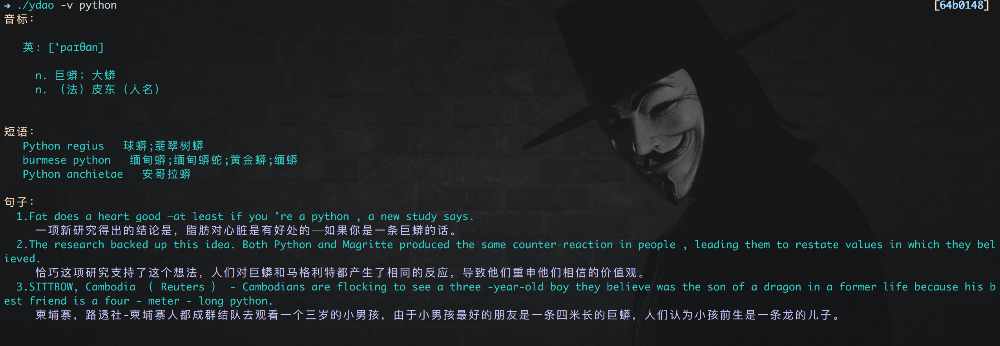

# ydao

[](https://travis-ci.org/BeginMan/ydao)  

对 https://github.com/TimothyYe/ydict 的改进



# Install

```bash
$ brew tap beginman/tap 
$ brew install beginman/tap/ydao
```

# Usage

```bash

██╗   ██╗██████╗  █████╗  ██████╗
╚██╗ ██╔╝██╔══██╗██╔══██╗██╔═══██╗
 ╚████╔╝ ██║  ██║███████║██║   ██║
  ╚██╔╝  ██║  ██║██╔══██║██║   ██║
   ██║   ██████╔╝██║  ██║╚██████╔╝
   ╚═╝   ╚═════╝ ╚═╝  ╚═╝ ╚═════╝

ydao V1.2 好好学学英语吧...


Usage:
ydao <option> <word>            Query the word(s)
ydao -v <word(s) to query>      Query with speech
ydao -m <word(s) to query>      Query with more example phrases and sentences
ydao -w <word(s) to query>      Query and open browser to get detail
ydao -list                      List query word histor
ydao -clean                     Clean query word histor
ydao -dump                      Dump query word histor
```

# TODO

- [x] 添加 `-w` 选项，打开网页查询详情
- [x] 添加 `-list` 选项，查询历史
- [x] 添加 `-clean` 选项，清除记录
- [x] 添加 `-dump` 选项，导出到csv


